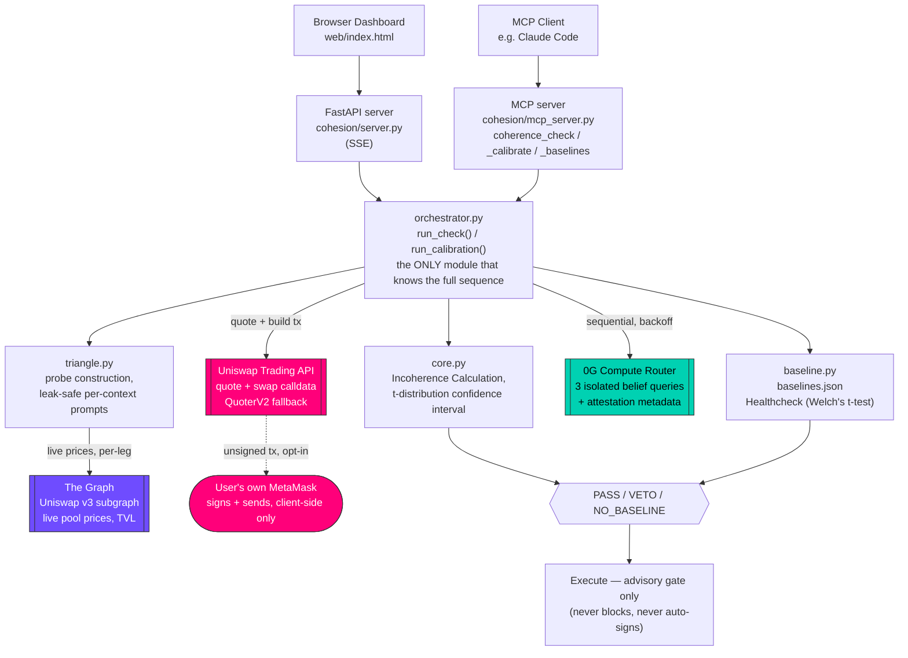

# 🔺🩺 Cohesion — A Reasoning Health Check for AI Agents

**ETHGlobal Lisbon 2026** — AI agents + verifiable inference + DeFi

> Advises whether an AI agent's reasoning has drifted from its own normal — before it moves your money.

**Team:** Iaroslav Karkunov — Telegram [@wknvw](https://t.me/wknvw) · X [@apocnab](https://x.com/apocnab)

**Live demo:** [https://94-130-105-233.nip.io/](https://94-130-105-233.nip.io/) — the six models already
calibrated in [baselines.json](./baselines.json) work out of the box for PASS/VETO checks. Calibrating a
*new* model on this shared instance requires your own funded 0G mainnet account and 0G API key (get one at
[pc.0g.ai](https://pc.0g.ai) after depositing 0G tokens) — paste it into the "Your own 0G API key" field at
the top of the page, since this deployment's own key is deliberately not spendable by every visitor.

---

## Architecture

One engine (`cohesion/orchestrator.py`), two entry points, three load-bearing sponsor integrations:



**The Graph** (purple) supplies every live price the probe triangle is built from — never mocked. **Uniswap**
(pink) turns the check into a real, quotable, optionally-signable trade. **0G Compute** (teal) runs every
belief query the whole measurement depends on. Detail on each integration, with file/line pointers, is
in [How It's Made](#how-its-made) below.

---

## The Problem

Autonomous agents are starting to move real money. Before one does, you want to know something basic:
**are its beliefs even self-consistent, and has that changed since it was last known good?**

Hardware attestation — like 0G's TEE-sealed inference — proves *who spoke*: that this exact model produced
this exact output, unaltered. It says nothing about whether what was said hangs together, or whether it's
gotten worse. An agent can be perfectly honest, running unmodified, and still hold beliefs that describe a
world which cannot exist — and every model does, to some degree. **Cohesion measures that gap, and gates on
drift from an agent's own calibrated baseline, not against an impossible ideal of zero incoherence.**

---

## How It Works

### 1. Build a probe triangle around a real trade

When a user sets up a swap, Cohesion auto-selects a third asset (by TVL, from a fixed liquid set) to close
the cycle. For a WETH→USDC swap it might pick WBTC, giving the loop **WETH/USDC → USDC/WBTC → WBTC/WETH**.

The triangle is **not the trade** — it's instrumentation built around it. A closed cycle is the smallest
structure where belief consistency is enforceable by arithmetic rather than opinion.

### 2. The constraint is arithmetic, not opinion

Each leg gets a binary proposition about the next 24 hours:

| | Leg | Proposition |
|---|---|---|
| **A** | WETH/USDC | ends HIGHER than now |
| **B** | USDC/WBTC | ends HIGHER than now |
| **C** | WBTC/WETH | ends HIGHER than now |

Because the three ratios multiply to exactly 1 (the cycle returns to WETH), two of the eight combinations
are impossible — and every surviving world has **exactly two disagreeing pairs**:

| # | A | B | C | A≠B | B≠C | A≠C | Total | Possible? |
|---|---|---|---|---|---|---|---|---|
| 1 | ↑ | ↑ | ↑ | · | · | · | **0** | ❌ product would exceed 1 |
| 2 | ↑ | ↑ | ↓ | · | ✓ | ✓ | **2** | ✅ |
| 3 | ↑ | ↓ | ↑ | ✓ | ✓ | · | **2** | ✅ |
| 4 | ↑ | ↓ | ↓ | ✓ | · | ✓ | **2** | ✅ |
| 5 | ↓ | ↑ | ↑ | ✓ | · | ✓ | **2** | ✅ |
| 6 | ↓ | ↑ | ↓ | ✓ | ✓ | · | **2** | ✅ |
| 7 | ↓ | ↓ | ↑ | · | ✓ | ✓ | **2** | ✅ |
| 8 | ↓ | ↓ | ↓ | · | · | · | **0** | ❌ product would fall below 1 |

Since the disagreement count is the constant 2 in every possible world, its expectation is 2 regardless of
how uncertain the forecaster is:

> **E[disagreements] = P(A≠B) + P(B≠C) + P(A≠C) = 2.000**

An agent landing below 2.000 isn't pessimistic or badly calibrated — it is assigning positive probability
to rows 1 and 8, worlds that cannot occur. In practice, real models never hit exactly 2.000; every model
carries some baseline incoherence (we measured 25–27% for our subject model, `deepseek-v4-flash`, on this
prompt — see [baselines.json](./baselines.json)). That's why gating happens against the agent's **own**
calibrated normal, not against the theoretical ideal.

### 3. Ask in isolation

Cohesion queries the three pairwise forecasts in **three separate, isolated inference calls** — a fresh
0G Compute request per context, never a shared conversation. Each context is shown only the two ratios
relevant to it ([cohesion/triangle.py](./cohesion/triangle.py)'s `build_context_slice`), so no single call
contains enough information to infer the third leg or the closed-cycle constraint.

### 4. Measure the incoherence

A linear program ([cohesion/core.py](./cohesion/core.py)'s `incoherence_lp`) asks whether those three
pairwise answers can be marginals of *any* single joint distribution over the six possible worlds. It
maximizes the belief mass that can be assigned consistently; whatever cannot be placed anywhere is the
**incoherence %** — the share of the agent's belief that lives in no possible world.

### 5. Compare to the agent's own baseline, then advise

A one-sided Welch's t-test ([cohesion/baseline.py](./cohesion/baseline.py)'s `compute_verdict`) compares
the live reading against a stored, previously-calibrated baseline for that exact model/prompt/pair. **The
system advises, it never blocks**: on `PASS`, the trade proceeds with no friction; on `VETO` (significantly
worse than baseline) or `NO_BASELINE`, the UI requires an explicit, deliberate acknowledgement before the
Execute action unlocks — but it always unlocks eventually, because coherence is a necessary, not sufficient,
condition for sound reasoning. Blocking would assert more than the measurement supports.

---

## How It's Made

**Stack:** Python throughout — FastAPI with Server-Sent Events for the streaming dashboard
([cohesion/server.py](./cohesion/server.py)), `scipy.optimize.linprog` for the coherence LP,
`scipy.stats.t`/`ttest_ind_from_stats` for confidence intervals and the drift test, `httpx` for The Graph
and the Trading API, `web3.py` for the QuoterV2 fallback, and a stdio MCP server
([cohesion/mcp_server.py](./cohesion/mcp_server.py)) exposing the identical engine as three callable tools.
Frontend is plain HTML/CSS/JS with no build step, consuming the SSE stream directly.

### The core: a linear program over possible worlds

Three binary propositions give 8 combinations, but the price identity forbids two, leaving 6 possible
worlds. The LP asks: does there exist a probability distribution over those 6 worlds whose pairwise
marginals match what the agent actually said? We maximize total assignable mass subject to marginal
constraints; if the optimum falls below 1.0, the shortfall *is* the incoherence %.

### Statistical honesty

Confidence intervals use a real **t-distribution critical value** (`t_{0.975, df}`), not a flat 2×SE —
at reps=3 the critical value is 4.30, not ≈2.0, which matters a lot at small sample sizes
([cohesion/core.py](./cohesion/core.py)'s `confidence_interval`, unit-tested in
[tests/unit/test_core.py](./tests/unit/test_core.py)). Below 3 reps per context, no variance estimate
exists at all, so the system reports `INSUFFICIENT_SAMPLES` and renders no verdict rather than force one.
The drift test itself uses `scipy.stats.ttest_ind_from_stats` — the summary-statistics form of Welch's
t-test — since the stored baseline keeps only (mean, std_dev, n), not raw samples.

### Partner integrations — all load-bearing

**The Graph** ([cohesion/graph_client.py](./cohesion/graph_client.py)) supplies the live data the entire
constraint depends on: querying the Uniswap v3 subgraph via the decentralized gateway for `token0Price`,
`token1Price`, `feeTier`, `liquidity`, and `totalValueLockedUSD` across the three probe pools, trying both
token orderings since the subgraph's `token0`/`token1` address-sort order is arbitrary and doesn't match
our semantic direction. TVL also drives auto-selection of the triangle's third leg
(`pick_third_asset`, [cohesion/triangle.py](./cohesion/triangle.py)). A guard rejects the run if the three
legs don't multiply to within 1% of 1.0 — that check certifies the triangle is currently arbitrage-tight,
which is what makes the constraint valid on independently-priced AMM pools rather than clean cross-rates.

**Uniswap** ([cohesion/uniswap.py](./cohesion/uniswap.py)) turns the check into a gated, real trade. The
Trading API (`POST /v1/quote`, `x-api-key` auth) is the primary path — required for the $7k API Integration
track's qualification bar of "a valid API key from the Uniswap Developer Platform" — with QuoterV2's
`quoteExactInputSingle` via `.call()` (a genuine static call, not a sent transaction — the quoter is
non-view by design and reverts to return its data) as a live fallback. See
[FEEDBACK.md](./FEEDBACK.md) for a real integration issue found and reported during this build: the Trading
API alternates unpredictably between a classic-route response and a completely differently-shaped
UniswapX/Dutch-auction order response for the same request, unless `protocols: ["V3"]` is set.

**0G Compute** ([cohesion/inference.py](./cohesion/inference.py)) runs every belief query, sequentially
with exponential backoff — 5-way concurrency triggers `503`s and ~1 req/s serial triggers `429`s on 0G's
router, so this is deliberately a plain loop, not `asyncio.gather`. Each response's attestation metadata
(provider address, response ID, verifiability) is captured and surfaced per-sample in the UI, honestly
labelled `"reported"` rather than `"verified"` when no cryptographic signature is present in the response.
Selecting a usable subject model took real trial-and-error against the live mainnet router: several Claude
models and a GLM reasoning model turned out to sit on an unhealthy provider or burn their entire token
budget on hidden reasoning with no way to disable it; `deepseek-v4-flash` was the model that actually
produced real sampling variance end to end (see `research.md`'s D10 for the full investigation).

### Two models, kept strictly separate

- **Caller / orchestrator** — Claude Code, the dashboard user, or any MCP client requesting a check. Never
  the subject.
- **Subject under test** — the agent named by the `model` argument, whose beliefs get probed on 0G Compute.

### Hacky bits worth mentioning

1. **Process-isolated querying, not conversation discipline.** The measurement only means anything if the
   agent genuinely cannot see its other answers. Each of the three contexts is a fully independent inference
   call, never a shared conversation — instructing a single conversation to "answer independently" would be
   unverifiable.

2. **A leak bug that became a design principle.** An early, cruder prompt showed incoherence *decreasing*
   when given the whole triangle's prices at once (0.68×) — the model could infer the closed-cycle
   constraint and enforce consistency it wouldn't otherwise have. `build_context_slice` now slices the data
   block per-context by construction, not by convention, and this is unit-tested.

3. **A price-direction bug the product check alone couldn't catch.** `graph_client.py`'s leg prices were
   briefly inverted (WETH/USDC showing `0.000532` instead of `~1880`) — the three-leg product still passed
   its 1% tolerance check throughout, because a *consistently* inverted convention also telescopes to 1.
   Caught only by adding a CLI (`python -m cohesion.graph_client`) and inspecting the actual displayed
   numbers against a known-good Trading API quote, not by trusting the product check alone.

4. **No mocked-data fallback, anywhere.** If The Graph, 0G, or the quote is unavailable, the run fails
   visibly. A cached-price fallback would have been trivial and would have quietly invalidated every claim
   this project makes.

**Same engine, two surfaces.** The dashboard (`server.py`) and the MCP server (`mcp_server.py`) both call
`orchestrator.run_check()`/`run_calibration()` directly, with zero decision logic of their own — so the two
interfaces return identical verdicts by construction, not by discipline. Verified live: the same
model/pair/reps through both `GET /api/check` and the MCP `coherence_check` tool resolved to the same
stored baseline and produced the same verdict shape.

---

## Sponsor Fit

| Sponsor | Track | How it is load-bearing |
|---|---|---|
| **The Graph** | Best AI Tooling | Live Uniswap v3 subgraph defines the triangle constraint; shipped as a reusable MCP server ("guardrail or auditor layer", not a single app) |
| **Uniswap** | Best API Integration | Trading API is the primary executable-quote path for the gated swap, with QuoterV2 as a live fallback; see [FEEDBACK.md](./FEEDBACK.md) |
| **0G** | Best Infrastructure & Tooling | Every query runs on 0G Compute; attestation metadata is captured and honestly labelled per-sample |

---

## Honest Assessment

**Established, live on mainnet:**
- `deepseek-v4-flash` reliably places **~25–27% of belief mass on logically impossible worlds** on this
  prompt when contexts are separated (`baselines.json`, n=12)
- Reproducible: a second independent 9-rep run landed at `disagreement_sum=1.473` (95% CI `[1.422, 1.525]`),
  clearly overlapping the stored baseline's `1.484 ± 0.079`
- Signalling (max marginal spread across contexts) stays low, so the measurement is clean

**Not established — and not claimed:**
- That a deliberate degradation reliably produces a `VETO`. A prior crude uniform-corruption test on an
  earlier prompt version moved the metric the *wrong* direction (0.28×) — a consistent lie gets coherently
  believed. This project does not ship a degraded-input demo mode; if we can't reproduce a real veto
  honestly, we don't fake one.
- That incoherence predicts P&L.

**The framing:** *coherent ≠ correct.* We detect self-contradiction and drift from an agent's own normal,
not wrongness. Like a compiler type-check — passing doesn't prove your program correct, but failing proves
something changed. Cohesion is a pre-trade sanity check on reasoning, never an alpha generator, and every
surface says so explicitly (see the `VETO` warning copy in `web/index.html`).

**One more limit worth stating:** coherence catches *fragmented* compromise (asymmetric prompt injection, a
split-brain data feed), not *uniform* compromise. An agent biased consistently in one direction passes the
check while still being wrong.

---

## Mathematical Background

- **Boole (1854)** — conditions on probability distributions
- **de Finetti (1931)** — the Dutch book theorem: coherence ⟺ no guaranteed loss
- **Vorobyev (1962)** — gluing conditions for marginals
- **Bell / Fine (1964–1982)** — contextuality in quantum foundations
- **Abramsky–Brandenburger (2011)** — sheaf-theoretic generalization
- **Abramsky–Barbosa–Mansfield (2017)** — contextual fraction via linear programming

The three context tables form a **presheaf**; coherence is precisely the question of whether it glues into a
**sheaf**. This is the same machinery used to analyze Bell inequalities, applied to AI agent beliefs.

---

## Repository

```
cohesion/
  core.py          # incoherence calculation + t-distribution CI + reading assembly    (pure, unit-tested)
  triangle.py       # probe construction, propositions, leak-safe prompts     (pure, unit-tested)
  baseline.py        # key derivation, atomic storage, drift-verdict decision  (unit-tested)
  graph_client.py     # live Uniswap v3 pool data                              <- The Graph
  uniswap.py           # Trading API quote + QuoterV2 fallback                  <- Uniswap
  inference.py          # 0G Compute Router client + attestation capture        <- 0G
  orchestrator.py        # run_calibration() / run_check(), shared by both interfaces
  server.py                # FastAPI, SSE endpoints, serves web/
  mcp_server.py             # stdio MCP: coherence_check / _calibrate / _baselines
web/
  index.html         # single-page dashboard (calibrate + trade/gate), no build step
tests/unit/
  test_core.py        # LP, CI, six-worlds enumeration
  test_baseline.py      # key derivation, atomic write, all 5 verdict boundaries
scripts/
  probe_0g.py           # standalone 0G connectivity + sampling-variance sweep
specs/                 # Spec Kit artifacts (spec, plan, tasks, research, contracts)
experiments/          # day-one validation runs (first hours of the event)
```

## Running It

### Prerequisites — this needs real credentials, not just a clone

`cohesion/config.py` loads `.env` and refuses to start if anything's missing (`RuntimeError` naming every
missing var) — there is deliberately no partial/degraded mode, per the no-mocked-data posture above. Four
keys need to be obtained and filled into `.env` before anything works; everything else in `.env.example` is
already a correct, working default and shouldn't be changed.

| Variable | Get it from | Notes |
|---|---|---|
| `GRAPH_API_KEY` | [thegraph.com/studio/apikeys](https://thegraph.com/studio/apikeys/) | Self-serve, instant. Free tier (100k queries/month) is plenty. |
| `UNISWAP_API_KEY` | Uniswap Developer Platform dashboard | Self-serve; issuance latency has varied. Required for the primary quote path — QuoterV2 is only a fallback. |
| `ETH_RPC_URL` | Any RPC provider (e.g. Alchemy free tier) | Only exercised if the Trading API is unreachable and it falls back to QuoterV2. |
| `ZG_API_KEY` | [pc.0g.ai](https://pc.0g.ai) mainnet portal, **after depositing real 0G tokens into a ledger** | The slow one — budget real time for the token purchase/deposit before the key becomes usable. Must be a general-purpose key from the main "Create key" flow, not the per-provider "Advanced" flow (that issues an app-scoped key that 401s against the shared router). |

**Don't change `ZG_MODEL`** from the shipped default (`deepseek-v4-flash`) without re-reading the comment
block above it in `.env.example` — most other 0G-hosted models were tested and ruled out for this project:
several sit behind an unhealthy provider (`BALANCE_INSUFFICIENT` regardless of funding), and reasoning models
like `glm-5.2` burn their entire token budget on hidden `reasoning_content` and never emit a parseable answer
unless `enable_thinking: false` is honored — which only `deepseek-v4-flash` does reliably (see `research.md`
D10 for the full investigation).

Without all four keys correctly set, nothing runs — not the dashboard, not the MCP server, not the CLI
entry points. There is no cached/offline demo mode.

```bash
cp .env.example .env    # fill in GRAPH_API_KEY, UNISWAP_API_KEY, ETH_RPC_URL, ZG_API_KEY
python3 -m venv .venv && source .venv/bin/activate
pip install -r requirements.txt
pytest tests/unit -v    # 20/20, pure math + baseline logic, no network needed — works without .env
uvicorn cohesion.server:app --port 8000
```

Open `localhost:8000`. The repo ships a real calibrated baseline (`baselines.json`, `deepseek-v4-flash` /
WETH-USDC-WBTC), so you can run a check against it immediately without recalibrating first — default is 3
reps per context (~35s), the calibrate slider goes to 9–15 for a fresh baseline.

**MCP:** `.mcp.json` registers `cohesion` for Claude Code (`python3 -m cohesion.mcp_server`, stdio). See
[contracts/mcp-tools.md](./specs/001-agent-coherence-guard/contracts/mcp-tools.md) for the tool schemas.

### Reproducing the original day-one validation

```bash
cd experiments
python3 -m venv venv
./venv/bin/pip install scipy numpy
./venv/bin/python coherence_test.py 4    # baseline, 4 reps
./venv/bin/python coherence_ab.py 5      # A/B blind vs grounded, 5 reps
```

Uses the local `claude` CLI as the model under test. Each run ~5–10 minutes. This was the first-hours
validation that motivated the whole project — the shipped system uses 0G Compute, not the local CLI, as its
subject model.

---

**Builder:** Slava Karkunov · karkunow@gmail.com
**Event:** ETHGlobal Lisbon 2026 (July 24–26)
